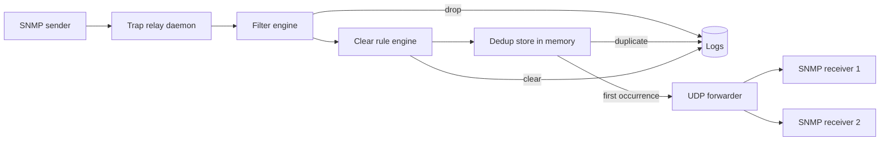

# Architecture

## Components



## Flow

1. The daemon listens on a UDP port.
2. Every incoming datagram is decoded as an SNMP trap or inform.
3. SNMPv3 decoding uses the configured `receiver.v3_users` when present.
4. Filter rules are evaluated first.
5. Clear rules are evaluated next.
6. Alarm rules are evaluated in order.
7. A matching alarm gets a dedup key from configured fields.
8. If the key is new, the original SNMP datagram is forwarded unchanged and a state entry is created.
9. If the key already exists and has not expired, the trap is suppressed.
10. If the alarm's embedded clear trap matches, the corresponding alarm state is removed.
11. On `SIGHUP`, the daemon reloads config, forwarders, decoder settings and logging without stopping the listener.

## Dedup model

The dedup cache is an in-memory map:

- key: alarm rule id + derived key hash
- value: first trap snapshot, timestamps and suppression counter
- expiration: TTL from the alarm rule

This makes dedup fast and keeps the runtime simple.

Forwarding is pass-through at the payload level:

- The daemon decodes traps for matching, logging and dedup decisions.
- The forwarded packet is the original SNMP datagram, not a re-encoded copy.
- Only the UDP source address changes because the relay sends a new datagram to the downstream receiver.

## Multi-host correlation

To deduplicate the same logical alarm across multiple monitored hosts, do not include `source_ip` in the alarm rule key fields.

Example:

```yaml
dedup:
  ttl_seconds: 300
  key_fields:
    - trap_oid
    - fields.ifIndex
    - fields.device_id
```

If `source_ip` is added to the key fields, the same alarm from different hosts will no longer deduplicate together.
